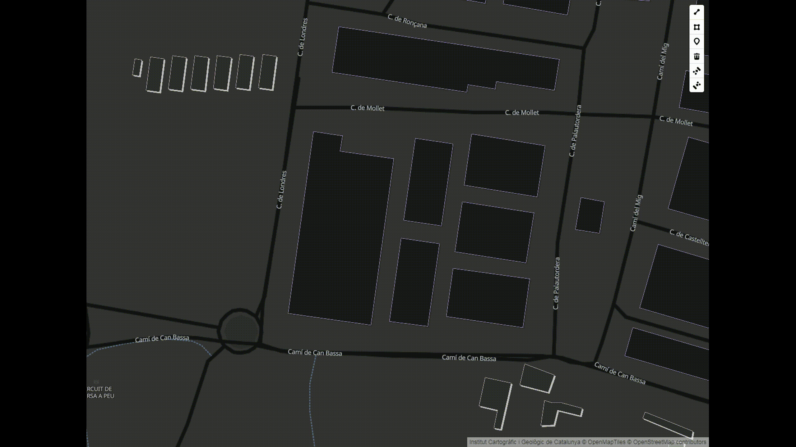

## Mapbox GL Draw Rectangle Oriented Mode
[](https://badge.fury.io/js/%40geostarters%2Fmapbox-gl-draw-rectangle-oriented-mode)

This is a custom mode for (Mapbox GL Draw) [https://github.com/mapbox/mapbox-gl-draw]  that adds the functionality to draw  oriented rectangles.





Based on:

https://github.com/thegisdev/mapbox-gl-draw-rectangle-mode

https://github.com/mapbox/mapbox-gl-draw/blob/master/src/modes/draw_polygon.js


### Install

`npm install @geostarters/mapbox-gl-draw-rectangle-oriented-mode`

### Demo 

https://geostarters.github.io/mapbox-gl-draw-oriented-rectangle-mode/index.html

### Usage

```js
import DrawRectangle from 'mapbox-gl-draw-rectangle-oriented-mode';

        mapboxgl.accessToken = '';
        var map = new mapboxgl.Map({
            container: 'map',
            style: 'https://tilemaps.icgc.cat/tileserver/styles/water.json',
            center: [2.278507, 41.594896],
            zoom: 16
        });

        var modes = MapboxDraw.modes;
        modes.draw_oriented_rectangle = DrawOrientedRectangle.default;
        var draw = new MapboxDraw({
            modes: modes
        });
        map.addControl(draw);
        draw.changeMode('draw_oriented_rectangle');
        map.on('draw.create', function (feature) {
            console.log(feature);
        });
    
```


### Build

`npm build-web`  with browsify

`npm build-all`  with babel

.

### License

MIT
